# Mi País: Un banco para millennials.

Los millennials son aquellos nacidos en los años 80 en adelante y poseen características que los hacen únicos: la tecnología, es una herramienta natural para estos jóvenes en su día a día, el internet, el dispositivo móvil, los medios sociales son su forma de vida; están descontentos y son incrédulos, tienden a confiar menos en las personas que las generaciones anteriores, se declaran independientes y forman el grupo con mayor descontento político y religioso.

La percepción de las generaciones más jóvenes acerca de los bancos es completamente diferente al de las generaciones precedentes: desconfían de los bancos y de los gestores por sentir que sólo querían engañarlos y venderles cosas que no necesitan, no perciben ninguna diferencia entre los bancos y no los ven como parte de su vida cotidiana.

Es por ello que nace que se propone crear un nuevo banco, basado en tecnología digital. El cual no tienen sucursales físicas y ofrecen servicios a través de aplicación móvil, ya que para estos jovenes la autonomía es la capacidad de lograr metas, amortiguar los imprevistos y sentirse menos dependientes.

# Kick-off
##  Preguntas a Stakeholders

Estás son las personas a las que consideramos importantes para el desarrollo de nuestro proyecto.

1. CEO
    - ¿Cuál es el propósito que quiere conseguir con la transformación digital?
    - En cuánto tiempo estima conseguir la transformación digital?
    - Qué es lo que espera conseguir durante la transformación digital?
  
2. Gerentes (Riesgos, Marketing, Operaciones, RRHH, IT)
    - Cúal es el riesgo de realizar esta transformación?
    - Cúal será la estrategia para poder desarrollar el producto?
    - Qué personas vamos a necesitar al momento de desarrollar el proyecto?
    - Qué tecnologías usaremos?
  
3. Product Managers
    - ¿Con quién elaboraría los estudios de mercado de desarrollarse el producto?
    - ¿Cómo se elaboraría el plan de marketing?
4. Regulador estatal
5. Jefes
6. Ejecutivos
7. Analistas
8. Auditor

## Objetivo para nuestra app

Crear un banco digital para millennials que pueda adaptarse a sus necesidades ofreciendoles todos los sevicios de un banco tradicional.

### Bussines Model Canvas

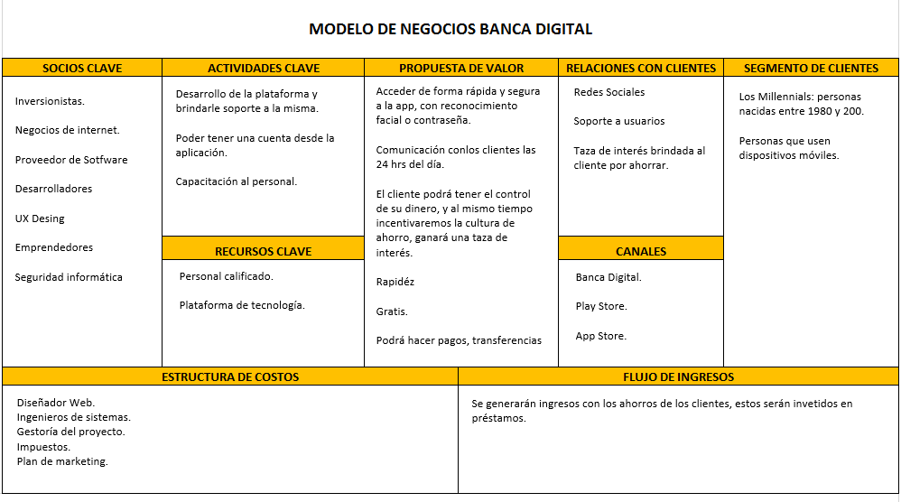

# Flujo de trabajo 

Trabajamos con la herramienta Trello

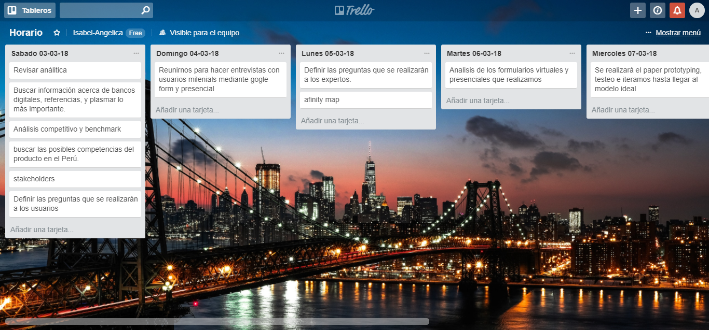
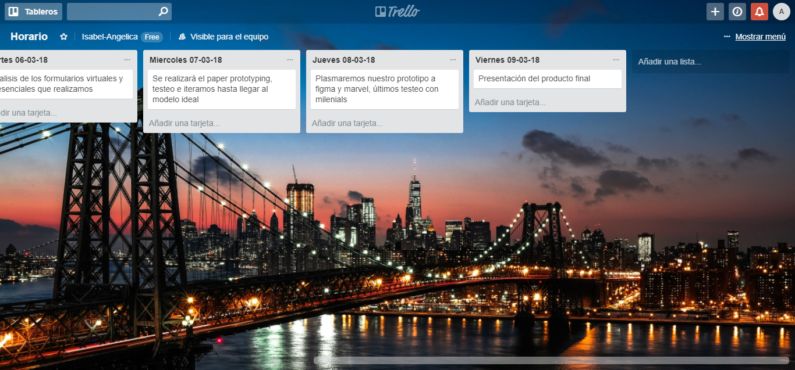

***
# Modelo de entrevista

## Objetivo.

Conocer a fondo a los milenians para crear un banco 100% digital.
También es importante saber a detalle sus preferencias, gustos, y de qué manera usan la tecnología en su día a día.

De qué manera ofrecerle seguridad en sus transacciones.
Entender qué les gusta y qué no cuando interactúan con sus finanzas personales
Cuáles son las referencias que tienen estos usuarios en términos de tecnología (apps, dispositivos, etc).
Los milenians no están familiarizados con el sector financiero.

## Introducción.
Hola, soy “entrevistador” y voy a ser la persona encargada de guiarte durante toda la entrevista. Lo que queremos es conocerte un poco y saber con qué frecuencia visitas un banco, si tienes alguna app que te permita hacer las mismas transacciones que haces en una agencia de una manera más rápida y sencilla. Ésta conversación será grabada, el fín es utilizar la información para la App que estamos desarrollando.

Warming Up

Nombre:
Edad:
Distrito:
Tipo de teléfono:
Banco de preferencia:
App del Banco:

Detailed Interview

### GUÍA DE ENTREVISTAS

¿Usted es titular de una bancaria?¿En qué banco?
¿Qué tan seguido va usted a un banco?
¿Qué tipo de operación hace usted cuándo va a un banco?
¿Ha tenido algún inconveniente cuándo ha realizado algunas operaciones?
¿Cómo definiría usted su experiencia asistiendo a un banco?
¿Utilizas la red de cajeros y agentes?
¿Ha tenido algún inconveniente cuándo ha realizado algunas operaciones?
¿usted hace uso de alguna app que realice las mismas operaciones que hace al acercarse a un banco?
                                 
           
## Si							                                                    ## No

¿Cómo se enteró de la existencia de dicha app?                                      18. ¿Por qué no lo hace?
¿Tienes dificultad al momento de utilizar la aplicación?                            19. ¿Qué opinas sobre poder hacer las operaciones bancarias desde tu teléfono?
¿Qué operaciones, suele realizar en la aplicación?                                  20. ¿Por qué motivo no lo hace?
Qué le motivó a seguir utilizando esa herramienta?                                  21. ¿Qué tendría que ofrecerle, para que usted pueda confiar en una banca móvil?
¿Usted tiene cultura de ahorro?No:¿Por qué no lo hace?                              22. ¿Usted tiene cultura de ahorro?
Sí: ¿Dónde ahorra su dinero?                                                        Sí: ¿Dónde ahorra su dinero?
No:¿Por qué no lo hace?                                                             No:¿Por qué no lo hace?
¿Qué opinas sobre poder hacer las operaciones bancarias desde tu teléfono?          23. ¿Qué opinas sobre poder hacer las operaciones bancarias desde tu teléfono?

                    

### Debrief

De lo que hemos conversado, ¿Hay alguna duda que tengas?, ¿Te gustaría agregar algo más para cerrar la entrevista?
Muchas gracias por por su tiempo :)

***

## Realizamos entrevistas presencialmente y virtualmente.

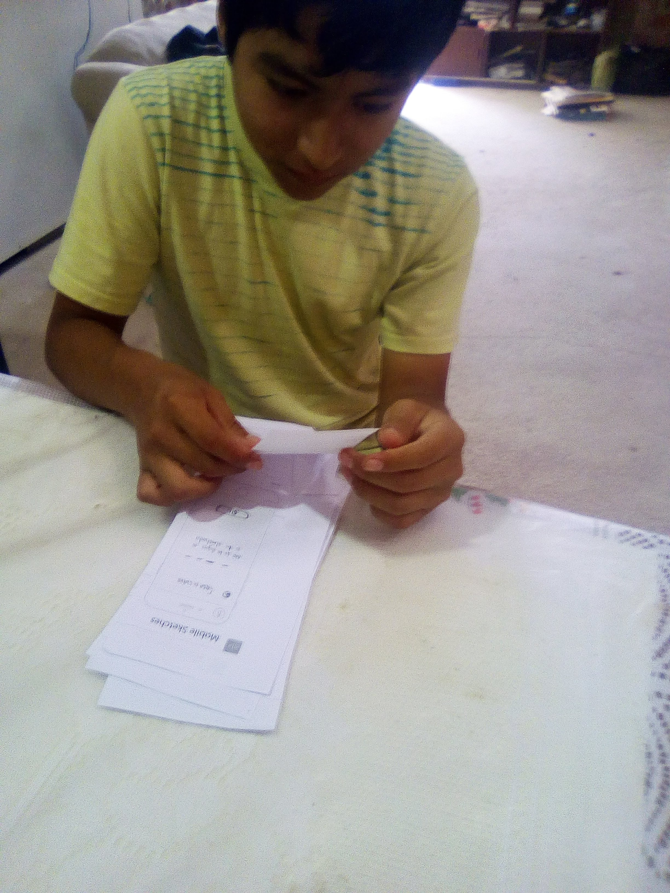

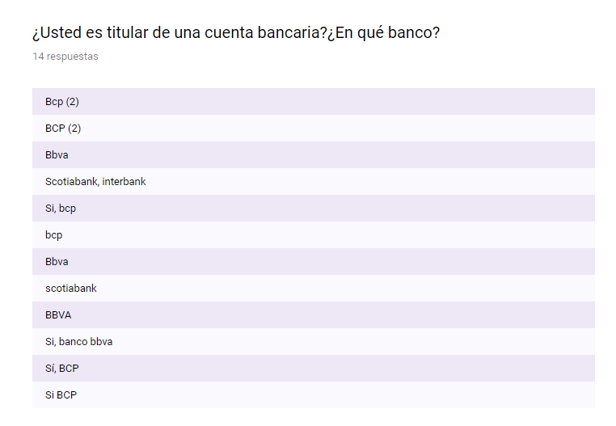
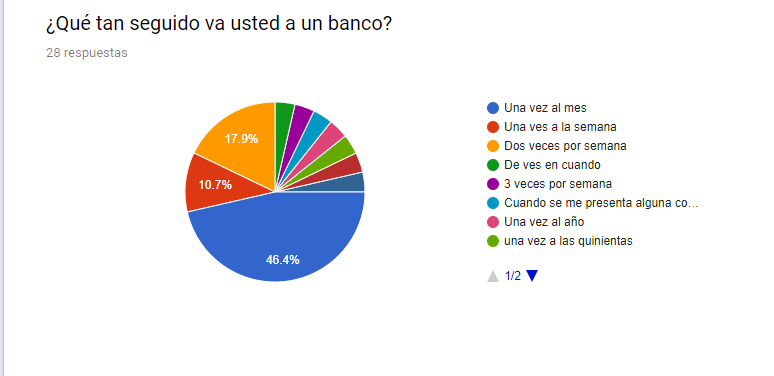
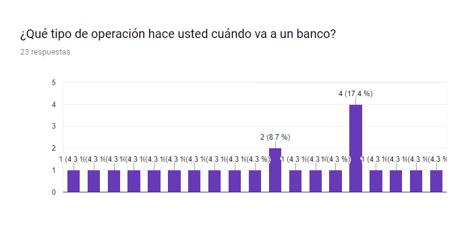
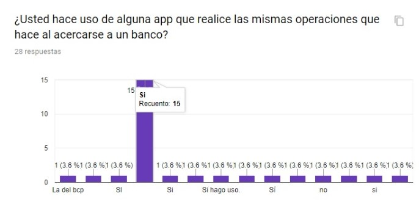
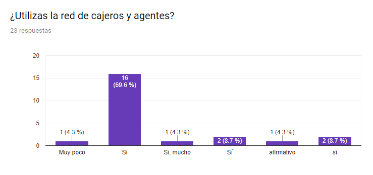

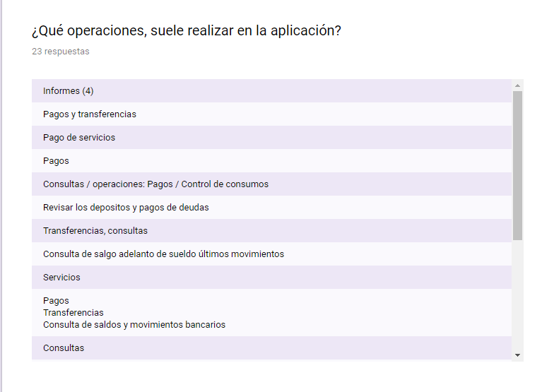
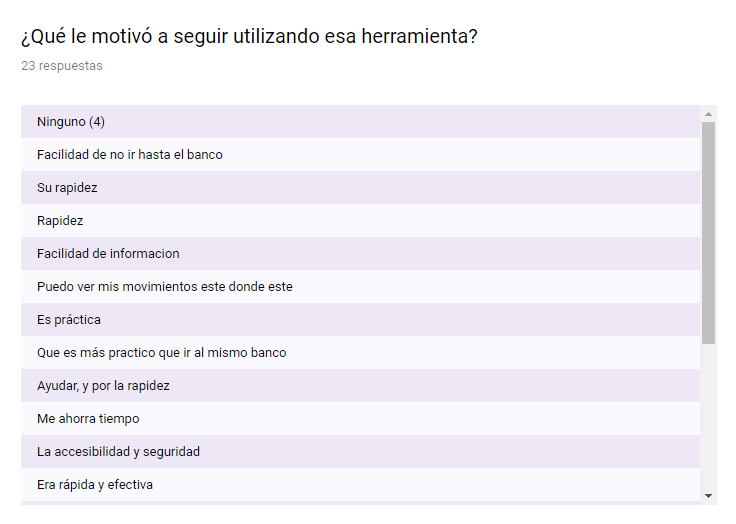
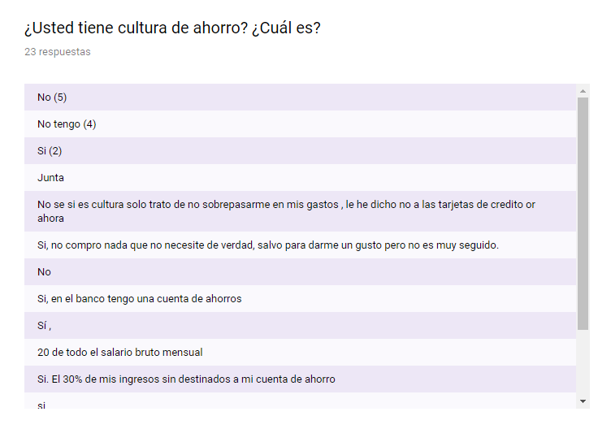
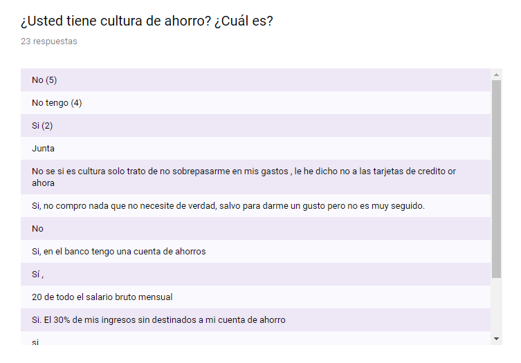
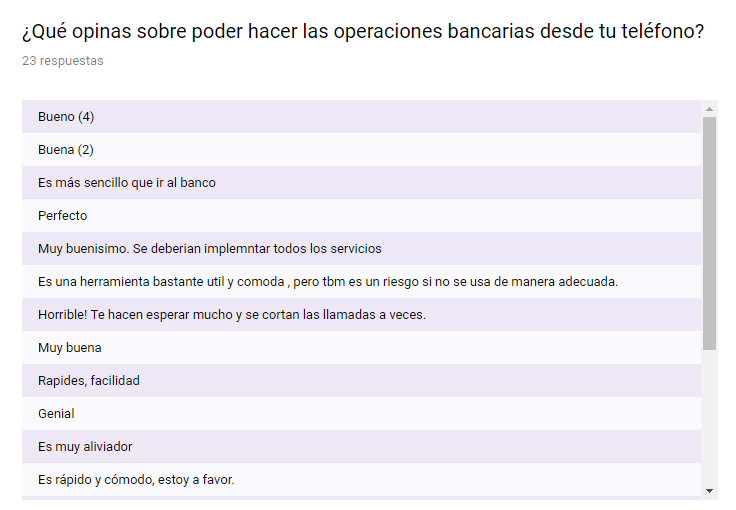

# Afinity map 
Llegamos a la conclusión de que los usuarios milenials principalmente hacen Pagos, Transferencias, Retiros llegando a la conclusión de que de cada 10 milenials 9 tienen cultura de ahorro.

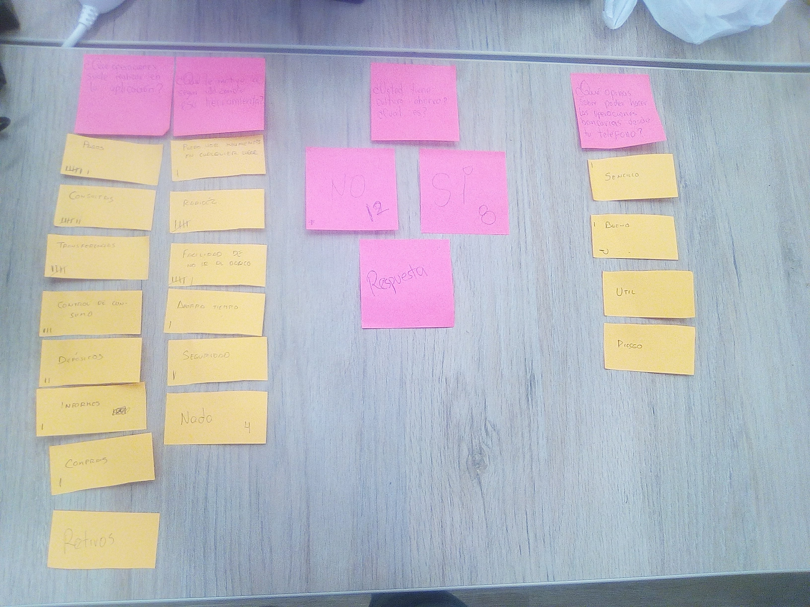

## Paper prototyping

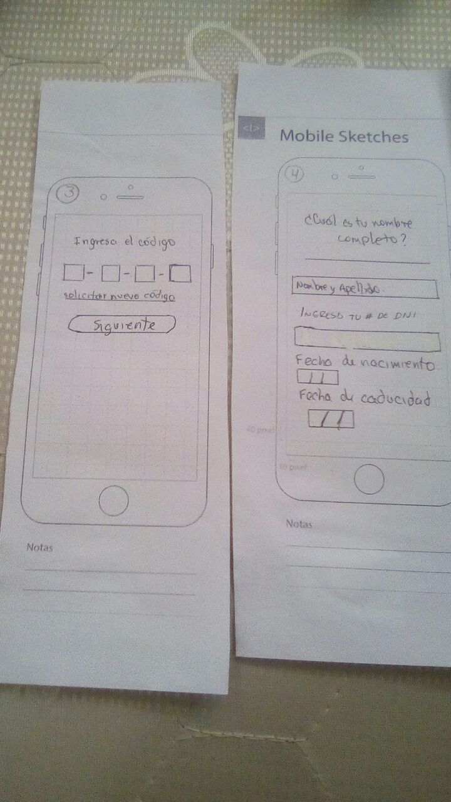
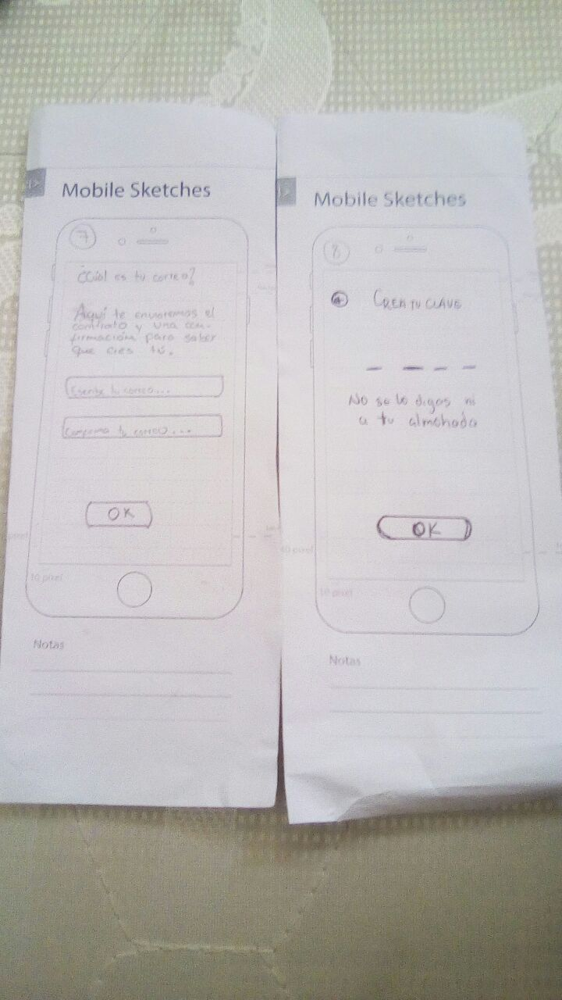
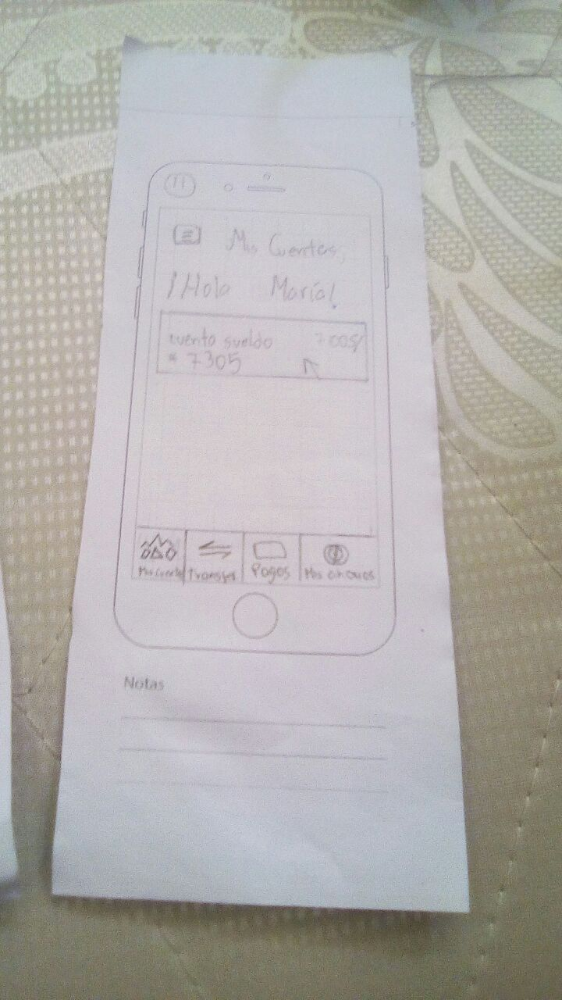

#Flujo de nuestra aplicación
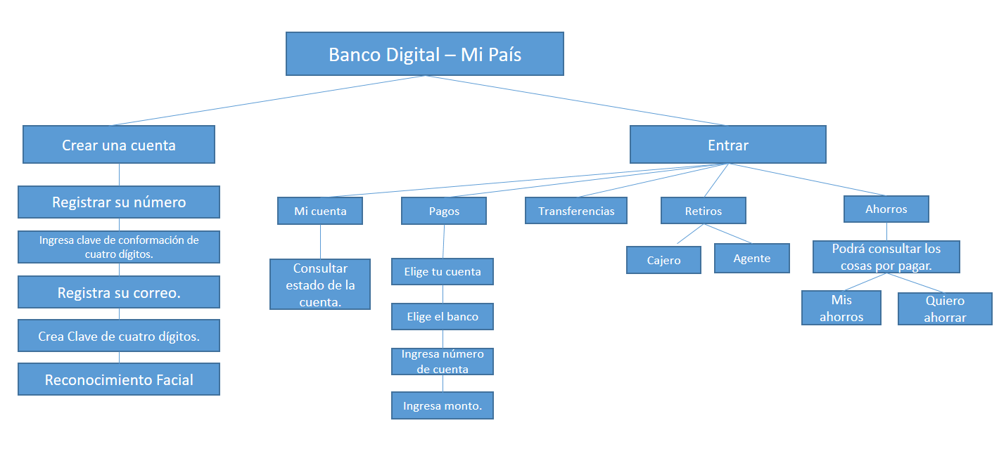

## Protipo final 

Trabajamos con las herramientas ´Figma´ ´Marvel´

[Figma](https://www.figma.com/file/F866NsK7ZVvBTnxT9nxv5Q9J/Untitled).  |

Nuestro producto se presento el día viernes 09-03-18

- [Primer producto opresentado](https://marvelapp.com/39i864e/screen/39487270). |

Recibimos feddback y realizamos los cambios

- [Producto mejorado](https://marvelapp.com/14a5eh2g/screen/39548994). |

